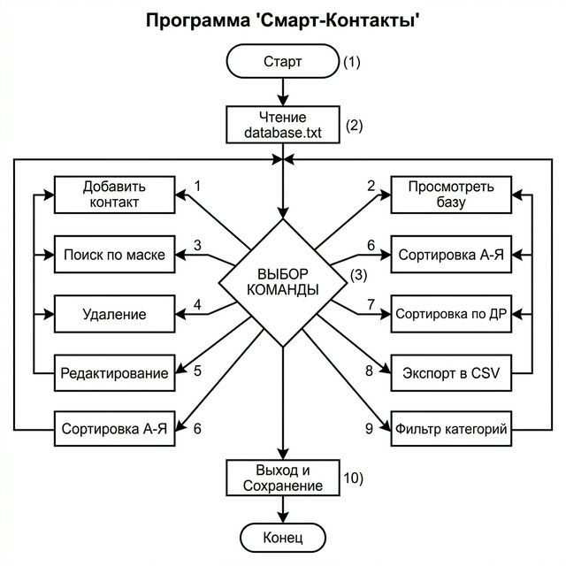

# Smart-Contacts System

Профессиональная система управления контактами на C++, оптимизированная для Visual Studio 2022.

## 🚀 Особенности
- **Полная поддержка UTF-8**: Корректное отображение кириллицы в консоли Windows.
- **Безопасность**: Валидация телефонов, email и дат.
- **Аналитика**: Экспорт в CSV и фильтрация по категориям.
- **Удобство**: Поиск по нескольким ключевым словам и умная сортировка.

## 📖 Документация
- [📄 Отчет по практике (Word)](123.docx)
- [🛠 Инструкция (Walkthrough)](walkthrough.md)

## 🛠 Требования
- Visual Studio 2022 
- Windows OS

---
*Проект выполнен студентом Кривошеевым К.Д., 2026.*
